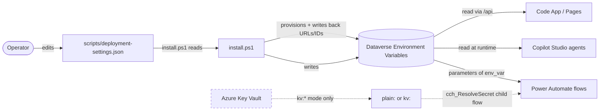

# Topic 4 — Environment variables (locked)

**Locked on:** 2026-04-29
**Scenario layer:** 🟢 **Scenario-agnostic** — the `<prefix>_<Category><Name>` convention, `plain:`/`kv:` SecretRef abstraction + `cch_ResolveSecret` child flow, install/upgrade/doctor lifecycle, categorized `deployment-settings.json` shape, JSON Schema validation — all reusable as-is. Forking: swap `cch_` → new prefix; refresh Brand strings; review the Id category for scenario-specific resources (Teams channels, agent IDs).

## Framing

Three categories of "env var" exist; this topic covers all three:

1. **Dataverse Environment Variables** (in the solution) — what flows + agents bind to via `parameters('env_var')`. The contract.
2. **Local build-time env** (`.env.local` from `.env.example`) — used by `pac` calls, `install.ps1`, React dev servers, seeders.
3. **GitHub Actions secrets** — already locked in handoff §3.16: `PP_SP_TENANT_ID`, `PP_SP_CLIENT_ID`, `PP_SP_CLIENT_SECRET`. Not relitigated.

## Decisions

| Area | Decision | Rationale |
|---|---|---|
| **Naming convention (Dataverse env vars)** | `cch_<Category><Name>` PascalCase. Categories: `Url`, `Id`, `Secret`, `Tunable`, `Feature`, `Brand` | Internally consistent with all other Dataverse objects (`cch_` prefix); category prefix groups variables alphabetically in the maker portal |
| **Categories in scope** | URLs, IDs/GUIDs, Secrets, Tunables, Feature flags, Brand strings | Covers every per-env value flows/agents touch; persona records and date offsets are intentionally out (§3.4 + §3.9) |
| **Secret storage** | **Plain-text Text env vars now, with a `SecretRef` abstraction so we can switch to Key Vault later without changing flows.** See "Secret abstraction" below | Operator-facing decision: avoids requiring Azure (per locked §3.14 runtime independence). Acknowledged smell, gated by `audit-permissions` + doctor checks; rotation is a documented operator step |
| **`deployment-settings.json` shape** | Categorized object with one top-level key per env-var category (`urls`, `ids`, `secrets`, `tunables`, `featureFlags`, `brand`) plus `superUsers` (Flavor-A array) and `connections` (per-connector owner override) | Mirrors env-var categories 1:1; JSON Schema gives editor IntelliSense and required-vs-optional enforcement |
| **Lifecycle behavior** | **Full lifecycle.** `install`: prompts for missing required, writes all to Dataverse. `upgrade`: detects new required env vars added since last deploy, prompts only for those (uses `cch_DeploymentVersion`). `doctor`: validates presence + format + (future) KV reachability | Makes env vars a first-class lifecycle citizen; matches the locked migration framework's drift-detection posture |
| **Feature-flag defaults** | All six vignette flags **ON** by default at install; operator toggles off per demo | Matches "each vignette demoable standalone" (§3.2); doctor warns on inconsistent dependency states (V6 requires V5 agent published, etc.) |
| **Concrete inventory** | **Drafted now, in this doc.** New env vars added later require a migration entry per the locked migration framework | Informs `install.ps1` stubs, `deployment-settings.schema.json`, and Phase-1 schema authoring |

## Secret abstraction

**Goal:** plaintext today, Key Vault tomorrow, **zero flow rewrites**.

### Storage convention
Every secret env var stores a string in one of two shapes:

| Mode | Value shape | Example |
|---|---|---|
| **Plain** (default, today) | `plain:<value>` | `plain:abc123-direct-line-secret-value` |
| **Key Vault** (future) | `kv:<keyVaultName>/<secretName>[?version=<v>]` | `kv:cch-demo-kv/DirectLinePatientSupport` |

### Resolution
- **PowerShell:** `scripts/lib/Secrets.ps1` exports `Resolve-Secret -Reference $value` — splits on the colon, returns the resolved string. Plain mode returns the rest of the string; KV mode calls `Get-AzKeyVaultSecret`.
- **Power Automate:** child flow `cch_ResolveSecret` accepts the env-var reference, returns the resolved value. Every flow that needs a secret invokes this child flow (one extra step) instead of reading the env var directly.
- **TypeScript (Code App / Pages, only for Direct Line token issuance):** apps never read secrets directly; they call the `cch_IssueDirectLineToken` flow which uses the resolver above.

### Doctor coverage
- Required `cch_Secret*` env vars must be non-empty and **must not** equal their template placeholder (`plain:<set-me>`)
- KV-mode references must resolve (operator running doctor must have read on the KV)
- Plain-mode values surface a warning on every doctor run: "secret stored in plaintext; consider migrating to Key Vault"

### Audit hook
`audit-permissions` skill (Tier-1, locked Topic 3) gains a side check: any `cch_Secret*` env var stored as `plain:*` emits an info-level finding. No blocking; just visible.

## Concrete inventory (initial)

> Naming: `cch_<Category><Name>`. Marker `[required]` means install/upgrade prompts; `[optional]` means falls back to default if unset. Marker `[TBD-Phase-N]` means the value can't be known until that phase.

### URLs (`cch_Url*`)
| Variable | Required? | Default / Source | Read by |
|---|---|---|---|
| `cch_UrlSharePointSite` | required | operator input at install | Knowledge agent, templated-doc flow, V5 citations |
| `cch_UrlPagesSite` | required | provisioned by `activate-site`, written back by install | V1 deep links from agents, V4 Adaptive Card "Open in Quality Workspace" |
| `cch_UrlCodeApp` | required | provisioned by `deploy`, written back by install | V4/V5 Adaptive Cards "Open in app" buttons, agent inline-action deep links |
| `cch_UrlTeamsTenant` | optional | default `https://teams.microsoft.com/l/` | Teams deep-link composition |
| `cch_UrlGraphBase` | optional | default `https://graph.microsoft.com/v1.0` | Teams channel post flow |

### IDs / GUIDs (`cch_Id*`)
| Variable | Required? | Default / Source | Read by |
|---|---|---|---|
| `cch_IdTeamsTeam` | required | provisioned by `install.ps1`, written back | All Teams channel-post flows |
| `cch_IdTeamsChannelQuality` | required | provisioned, written back | V4 triage card |
| `cch_IdTeamsChannelLeadership` | required | provisioned, written back | V4 escalation card |
| `cch_IdTeamsChannelField` | required | provisioned, written back | V3 FCS channel update |
| `cch_IdTeamsChannelEnablement` | required | provisioned, written back | V5/V6 enablement-tool result cards |
| `cch_IdSharePointLibraryKnowledge` | required | provisioned, written back | Knowledge agent grounding |
| `cch_IdAgentPatientSupport` | required | published from Copilot Studio | Code App docked panel, Pages floating bubble |
| `cch_IdAgentQualityTriage` | required | published from Copilot Studio | V4 triggered flow target |
| `cch_IdAgentEnablement` | required | published from Copilot Studio | V5 Knowledge tab, V6 surfaces |
| `cch_IdEntraAppPagesAuth` | required | provisioned by `install.ps1`, written back | Pages identity provider config |
| `cch_IdEntraAppServicePrincipal` | required | provisioned by `Setup-ServicePrincipal.ps1` | Documentation; not read by flows |

### Secrets (`cch_Secret*`)  *(stored as `plain:<value>` or `kv:...` per abstraction above)*
| Variable | Required? | Source | Read by |
|---|---|---|---|
| `cch_SecretDirectLinePatientSupport` | required | Copilot Studio channel config | `cch_IssueDirectLineToken` flow |
| `cch_SecretDirectLineQualityTriage` | required | Copilot Studio channel config | `cch_IssueDirectLineToken` flow |
| `cch_SecretDirectLineEnablement` | required | Copilot Studio channel config | `cch_IssueDirectLineToken` flow |
| `cch_SecretGraphAppClient` | required | Setup-ServicePrincipal.ps1 | Teams channel-post flow (SP+Graph) |
| `cch_SecretSPClient` | required | Setup-ServicePrincipal.ps1 | Connection reference setup only; not read by flows at runtime |

### Tunables (`cch_Tunable*`)
| Variable | Required? | Default | Read by |
|---|---|---|---|
| `cch_TunableLiveSimCron` | optional | `0 */10 8-18 * * MON-FRI` (Eastern) | Live-events simulator flow |
| `cch_TunableDemoRefreshCron` | optional | `0 0 5 * * *` (Eastern) | Daily refresh flow |
| `cch_TunableMdrClockHours` | optional | `18` | Complaint reset flow (V4 hero) |
| `cch_TunableShipmentStepSeconds` | optional | `30` | Compressed-timeline shipment advancer flow (V1/V2) |
| `cch_TunableTimezone` | optional | `Eastern Standard Time` | All scheduled flows |

### Feature flags (`cch_Feature*`)
| Variable | Default | Effect when off |
|---|---|---|
| `cch_FeatureV1PatientPortal` | `true` | Pages V1 nav hidden, registration form disabled |
| `cch_FeatureV2HCPPortal` | `true` | Pages V2 auth area hidden |
| `cch_FeatureV3FieldCompanion` | `true` | Code App "My Day" / Account 360 hidden |
| `cch_FeatureV4QualityTriage` | `true` | Quality nav hidden in Code App; triggered triage flow disabled |
| `cch_FeatureV5EnablementKnowledge` | `true` | Knowledge tab hidden |
| `cch_FeatureV6ExtendEverywhere` | `true` | Teams app + SP webpart + M365 publish skipped |
| `cch_FeatureLiveSim` | `true` | Live-sim flow paused regardless of `cch_LiveSimSetting` singleton |
| `cch_FeatureDailyRefresh` | `true` | Daily refresh flow paused |
| `cch_FeatureDemoModeBanner` | `true` | `<DemoModeBanner/>` returns null (escape hatch only — locked-on for actual demos) |

### Brand strings (`cch_Brand*`)
| Variable | Default |
|---|---|
| `cch_BrandCompanyName` | `Contoso Continuum Health` |
| `cch_BrandPrimaryColor` | `#0E7C86` (locked Topic 2 teal) |
| `cch_BrandFooterDisclaimer` | (canonical Microsoft-fictitious-disclaimer text — set in Topic 2 deliverable) |
| `cch_BrandDemoModeBannerText` | `Demo mode — synthetic data only` |

### Local build-time env (`.env.example` template)
| Variable | Purpose |
|---|---|
| `PP_TENANT_ID` | Operator tenant for `pac auth create` |
| `PP_ENVIRONMENT_URL` | Target env URL for build-time `pac` calls |
| `PP_SP_CLIENT_ID` | Same SP as Dataverse Application User |
| `PP_SP_CLIENT_SECRET` | (operator's local copy; never committed) |
| `DEPLOYMENT_SETTINGS_PATH` | Path override for `scripts/deployment-settings.json` |
| `LOG_LEVEL` | Verbosity for `install.ps1` (`info` / `debug` / `trace`) |

## `doctor.ps1` env-var-check spec

```
1. Load all cch_* env vars from target Dataverse env
2. Cross-reference against the inventory in this doc (canonicalized as JSON in scripts/lib/EnvVarManifest.json)
3. For each:
   a. Required env vars must be present
   b. URL env vars must start with https:// and not contain 'localhost' or '127.0.0.1'
   c. GUID env vars must match GUID regex
   d. Secret env vars: non-empty + not equal to template placeholder
   e. Plain-mode secrets emit a "consider KV" info finding
   f. KV-mode secrets must resolve (skip if Az module not installed; warn instead)
   g. Cron tunables must parse (PowerShell + Power Automate cron grammar — use Cronos)
   h. Boolean feature flags must be 'true' or 'false'
4. Diff inventory vs. deployed: any env var in the inventory missing from Dataverse → "missing required" finding for upgrade to prompt
5. Report findings via doctor's standard JSON + HTML output
```

## Mermaid: env-var sources



## Updates to earlier locked decisions

- **Handoff §3.14 install/upgrade/doctor responsibilities** — gain explicit env-var lifecycle behavior (install prompts, upgrade detects deltas, doctor validates).
- **Handoff §3.16 Tier 1** — already gained `audit-permissions` (Topic 3); now also flags plain-mode secrets as info findings.
- **Handoff §3.11 repo layout** — adds:
  - `scripts/lib/Secrets.ps1` (already implied by lib folder)
  - `scripts/lib/EnvVarManifest.json` (canonical inventory machine-readable form)
  - Flow `cch_ResolveSecret` (child flow) inside the solution
  - Flow `cch_IssueDirectLineToken` inside the solution
- **Handoff §4 Custom tables** — no new tables introduced by this topic.

## Deliverables to commit

1. **`docs/_planning/topic-04-env-vars.md`** ← this file (planning artifact, complete with concrete inventory)
2. **`scripts/deployment-settings.json.template`** — categorized template matching the inventory above (real, not stubbed)
3. **`scripts/deployment-settings.schema.json`** — JSON Schema with `required` arrays per category, GUID/URL format validators, and `oneOf` for the `plain:` vs `kv:` secret reference shape
4. **`docs/env-vars.md`** — operator-facing reference (rendered version of the inventory tables; also documents the secret abstraction)
5. **Cross-reference update to `docs/connectors.md`** — connection reference → env var(s) it needs → secret store location
6. **`scripts/lib/EnvVarManifest.json`** — machine-readable inventory consumed by `doctor.ps1`
7. **Mermaid diagram** above included in the topic doc; copied into `docs/architecture.md` at architecture-doc commit time

## Open follow-ups (deferred — not blocking)

- **Per-flow env-var binding inventory** (which flow reads which env var) — emerges naturally during Phase 4 flow authoring; no benefit to enumerating now.
- **Per-agent env-var binding inventory** — overlaps with **Topic 8 (per-agent topic & tool design)**.
- **KV provisioning helper** (`scripts/Setup-KeyVault.ps1`) — defer until an operator actually wants the KV path; the abstraction supports it without writing the script today.
- **Direct Line token-issuer flow rate limits** — defer to Phase 4 flow authoring.
