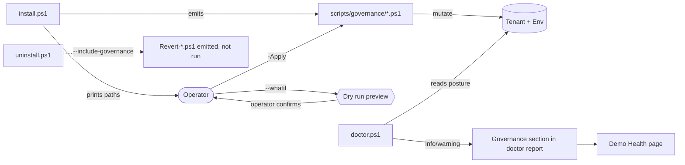

# Topic 5 — Governance config (locked)

**Locked on:** 2026-04-29
**Scenario layer:** 🟢 **Scenario-agnostic** — DLP groupings (Business+Blocked buckets), Managed Environment selections, audit-on-everything posture, Pipelines host pattern, per-concern scripts under `scripts/governance/` with `--whatif` defaults, doctor reports posture without changing it. All identical for any scenario built on the same Power Platform + M365 surface set. **Pharma caveat:** lean *more* into audit if scenario claims any GxP / 21 CFR Part 11 framing.

## Framing

- Locked **approach** in handoff §3.13 (recommendations doc, custom DLP scoped to dev env, ME opt-in, Pipelines host pre-provisioned, Solution Checker scheduled, audit log on, optional CoE pointer).
- Locked **delivery rule** in §3.14: DLP and ME scripts are **generated but never auto-applied** — operator runs them on demand.
- This topic turns the approach into **concrete config** that `install.ps1` emits and `doctor.ps1` reports on.
- All four governance concerns ship as **separate per-concern scripts** under `scripts/governance/`, each idempotent and each starting in `--whatif` dry-run mode by default.

## Decisions

### DLP

| Bucket | Members | Rationale |
|---|---|---|
| **Business** | Locked baseline (Dataverse, Outlook, Teams, SharePoint, Approvals, HTTP-with-Entra) **+ Direct Line, OneDrive for Business, Power BI, Word/Excel Online (Business), Microsoft Forms** | Direct Line: required for Code App + Pages → agent chats. OneDrive: in the locked Hybrid Connection Ownership exception list. Power BI: defensive for placeholder tiles. Word/Excel: needed by templated-doc weekly republish flow. Forms: enables forms-driven Approvals patterns for V4 Acknowledge/Escalate beats |
| **Non-Business** | **Empty** | Keeps the demo posture sharp — there is one approved combinable surface and everything else is blocked |
| **Blocked** | Everything not in Business | Default for any connector not enumerated above; explicit story for the V6 governance closer |

**Scope:** Applied **only to the demo dev env** named in `deployment-settings.json`. No tenant-wide impact.

### Managed Environment features

**Enabled** (`Apply-ManagedEnv.ps1` flips these on):

| Feature | Why |
|---|---|
| **Solution Checker enforcement + weekly run** | The ME headline; pairs with V6 governance closer |
| **Maker welcome content + usage insights dashboard** | Surfaces who-owns-what; pairs with the persona-attribution columns story |
| **Custom solution-checker rules** | `PA-prefer-environment-variable`, `PA-prefer-connection-reference` — enforces the locked Phase-0 discipline at env level (redundant with Tier-1, intentionally) |
| **Catalog publishing** | Demo solution shows up in env catalog; supports the V6 admin-screen-share closer |

**Intentionally NOT enabled** (documented in the script as commented-out blocks operator can flip on):

| Feature | Reason left off |
|---|---|
| **Limit sharing of canvas apps + app/flow inactive cleanup** | Personal demo asset doesn't accumulate orphaned resources at a rate that justifies the demo-time risk of a flow being auto-disabled mid-vignette. Operator can enable if they reuse the env for non-demo work |
| **IP firewall restrictions** | For prod tenants with VNet-injected envs; blocks operators behind home networks |
| **Customer Lockbox** | Microsoft-support-access feature; meaningless for a personal demo asset |

### Audit log

- **Scope:** **All three layers** — tenant-level Office 365 audit log, env-level Dataverse audit, **every custom `cch_*` table**.
- **Defaults:** Table-level auditing declared in the schema (`cch_*` tables have `IsAuditEnabled=true` baked in); column-level auditing on persona-attribution columns + V4 agent fields.
- **Script:** `Apply-Auditing.ps1` flips tenant + env switches; the table/column flags ride along with the solution import.
- **Why:** V4's "every change is traceable" beat needs all three layers. Tenant-level is usually already on in M365 tenants — script is a no-op there.

### Pipelines

- **Host env + 2 stage placeholders pointing back at dev** (no-op until edited).
- `Provision-Pipelines.ps1` creates the small host env (separate from dev env), registers the dev env as a deployable env, and defines two stage placeholders (`Test`, `Prod`) whose target is **the dev env itself**.
- Operator later edits the placeholders to point at real Test/Prod envs when those exist.
- Accidental "deploy to Test" is a no-op — protects against tutorial-driven mistakes.
- Aligns with locked §3.13: "provision Pipelines host now (no targets) so adding Test/Prod later is non-breaking."

### Delivery mode

- **Per-concern scripts under `scripts/governance/`:**
  - `Apply-Dlp.ps1`
  - `Apply-ManagedEnv.ps1`
  - `Apply-Auditing.ps1`
  - `Provision-Pipelines.ps1`
- Each script:
  - **Idempotent** — safe to re-run.
  - **Defaults to `--whatif`** — the operator must pass `-Apply` to actually mutate.
  - Reads target env name + scope from `deployment-settings.json` (single source of truth).
  - Logs to `scripts/governance/.last-run/<name>.log` (gitignored).
- `install.ps1`:
  - Emits/regenerates these scripts as part of install.
  - **Prints the file paths + a one-line description** of what each does.
  - **Does not run any of them** — operator runs on demand. Matches the locked "generated but never auto-applied" rule.
- `uninstall.ps1`:
  - Does not undo governance changes by default.
  - With `--include-governance`, emits *reverse* scripts (`Revert-Dlp.ps1`, etc.) but does not run them either.

### Doctor coverage

`doctor.ps1` adds a **Governance** section that *reports* posture without changing it. All findings are info or warning (never fail) — keeps the locked "doctor never changes data" rule clean.

```
[Governance]
- DLP: applied to <env>?            [pass | warning: not applied | info: applied to different env]
- DLP: Business bucket members      [pass: matches manifest | warning: drift detected, see diff]
- ManagedEnv: enabled on <env>?     [pass | warning: not enabled]
- ManagedEnv: Solution Checker      [pass | info: rule subset only | warning: disabled]
- ManagedEnv: Catalog publishing    [pass | info: not enabled]
- Audit: tenant-level               [pass | warning: disabled]
- Audit: env-level                  [pass | warning: disabled]
- Audit: per-table cch_* coverage   [pass | warning: N tables not auditing]
- Pipelines: host env present?      [pass | info: not provisioned (optional)]
- Pipelines: dev env registered?    [pass | info: not registered]
- CoE Starter Kit installed?        [info only — never gates]
```

Doctor output JSON is consumable by the Demo Health page (per locked §3.9).

## V6 governance-closer talking points (3 bullets)

> Drafted here so they're locked alongside the config. Final demo-script wording lands in `docs/demo-script.md` at Phase 6.

1. **One agent, one DLP boundary.** "Notice the same Continuum Enablement Agent in Code App, Teams, SharePoint, and M365 Copilot. Behind all of them is a single custom DLP that says: Dataverse, Outlook, Teams, SharePoint, Approvals, HTTP-with-Entra, Direct Line, OneDrive, Power BI, Word/Excel, Forms — combinable. Everything else: blocked. One policy, one story, every surface."
2. **Managed Environment, central visibility.** "Every flow, every agent, every app in this demo shows up in the Power Platform admin catalog with usage insights and solution-checker enforcement. When this scales to a real Quality team or a real field organization, the governance posture you see on screen scales with them."
3. **Audit, end-to-end.** "Tenant-level Office 365 audit, env-level Dataverse audit, table-level on every `cch_*` table, column-level on the persona-attribution and agent-decision columns. The complaint we triaged in V4 has a complete provenance story — who saw it, who edited the MDR draft, which agent wrote which field, when."

## Mermaid: governance lifecycle



## Updates to earlier locked decisions

- **Handoff §3.13** stays the *approach* of record; this topic is the *configuration* of record. No conflict.
- **Handoff §3.11 repo layout** — adds `scripts/governance/` folder containing `Apply-Dlp.ps1`, `Apply-ManagedEnv.ps1`, `Apply-Auditing.ps1`, `Provision-Pipelines.ps1` (and corresponding `Revert-*.ps1` emitted by uninstall on demand).
- **Handoff §3.14 install/uninstall scope** — confirms governance changes are **not** in the default uninstall scope (matches the locked "DLP/ME removal not default").
- **Handoff §3.15 doctor** — adds Governance section to the read-only health-check output.
- **Topic 4 env vars** — adds `cch_IdPipelinesHostEnv` (optional, set after Provision-Pipelines runs) to the Id category. Will fold into `EnvVarManifest.json`.

## Deliverables to commit

1. **`docs/_planning/topic-05-governance.md`** ← this file
2. **`docs/governance-recommendations.md`** — operator-facing real doc replacing the locked stub; includes the V6 closer talking points
3. **`scripts/governance/Apply-Dlp.ps1`** — idempotent, `--whatif` by default, reads `deployment-settings.json` for target env + uses the Business/Blocked manifest above
4. **`scripts/governance/Apply-ManagedEnv.ps1`** — enables the four selected ME features; commented-out blocks for the three intentionally-off ones
5. **`scripts/governance/Apply-Auditing.ps1`** — flips tenant + env switches; logs counts of `cch_*` tables already audit-enabled at solution-import time
6. **`scripts/governance/Provision-Pipelines.ps1`** — creates host env + registers dev env + defines `Test`/`Prod` placeholders pointing at dev
7. **Mermaid diagram** above included in topic doc; copied into `docs/architecture.md` at architecture-doc commit time
8. **Doctor `Governance` section spec** above implemented in `doctor.ps1` (Phase 0 work item updated)

## Open follow-ups (deferred — not blocking)

- **CoE Starter Kit pointer** — locked as optional info note in `governance-recommendations.md`; no script needed.
- **Catalog metadata** for the demo solution — schema-time decision in Phase 1.
- **Custom solution-checker rule definitions** (the YAML for `PA-prefer-environment-variable` etc.) — not all of these are first-party; final rule list lands when we author the ME script in Phase 0.
- **Per-environment governance baselines** (when Test/Prod actually exist) — far-future, not in scope for this demo.
